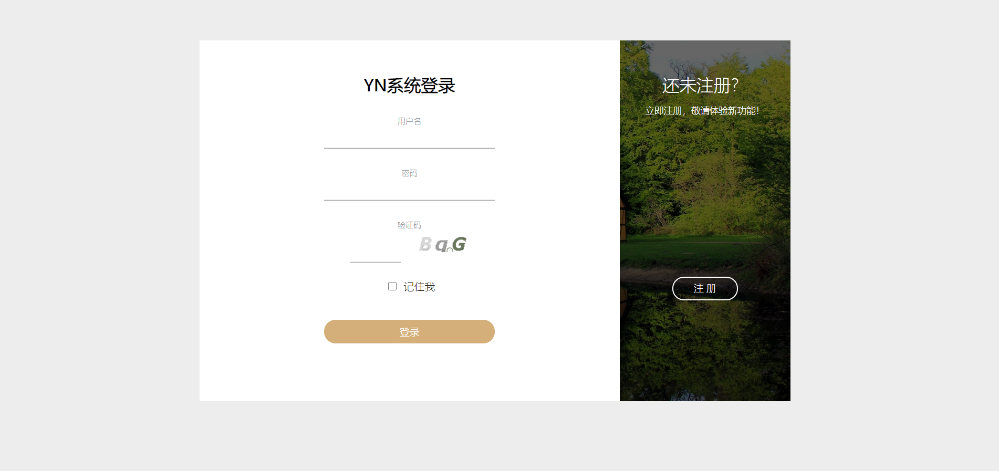
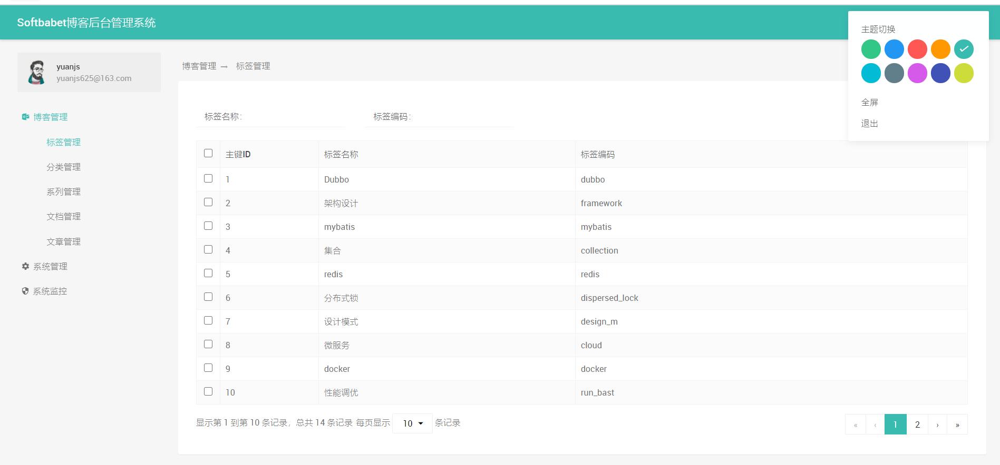
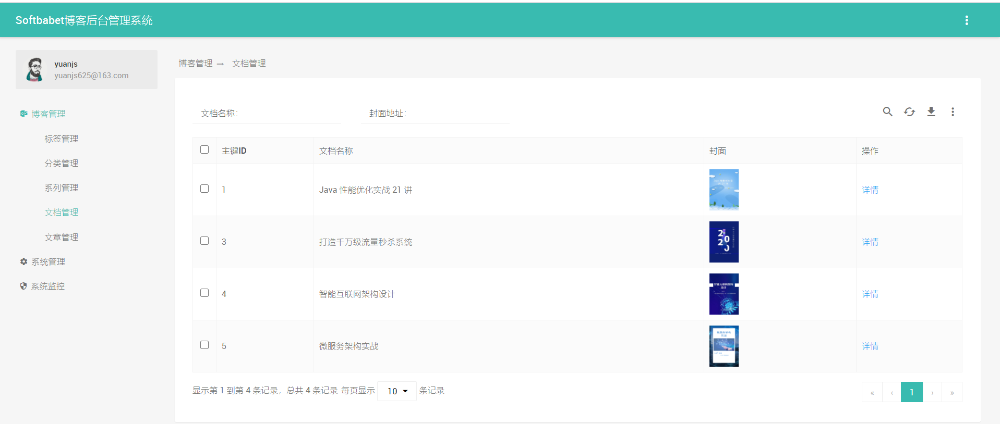
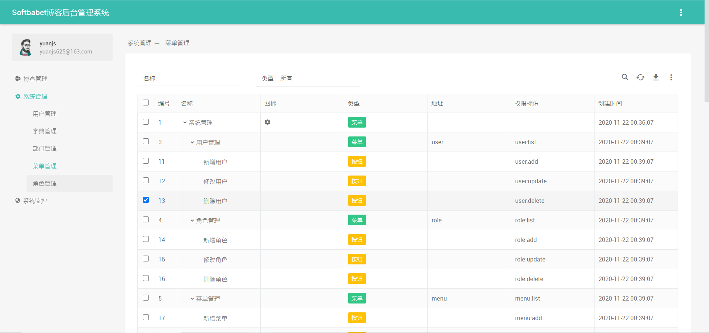
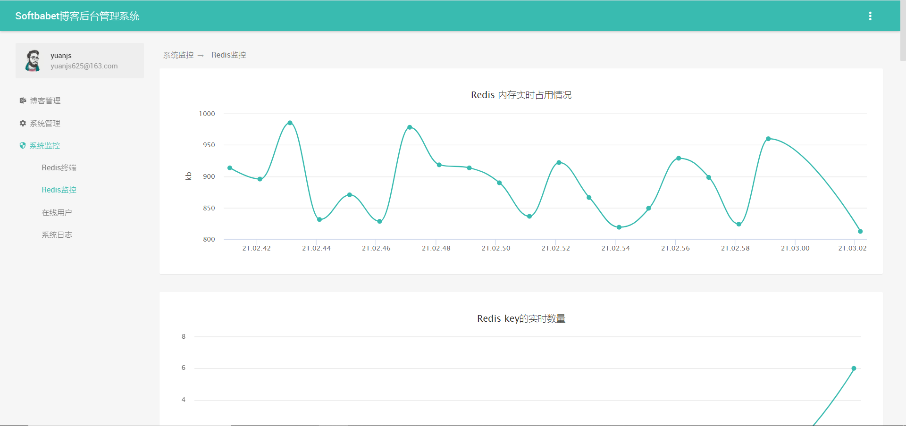
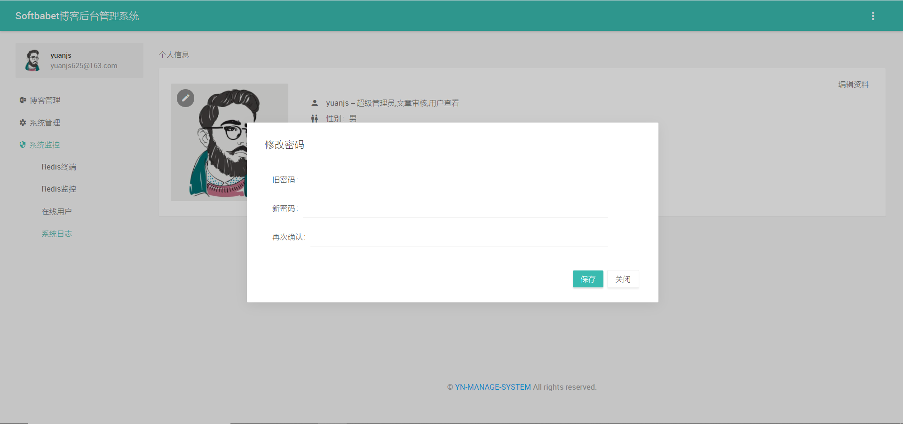
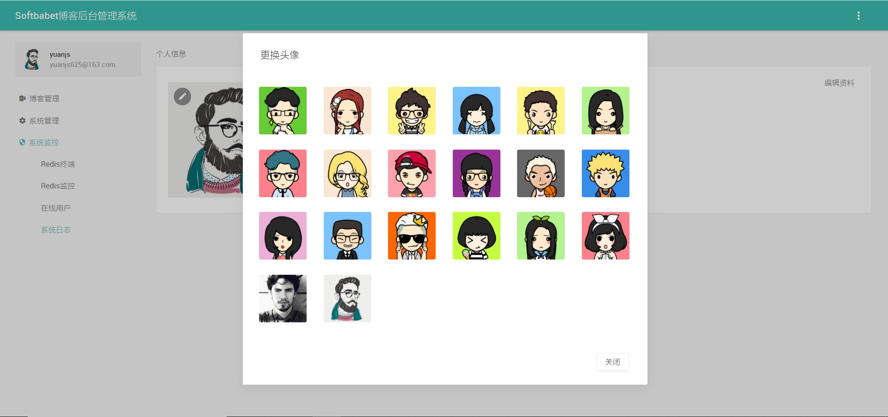
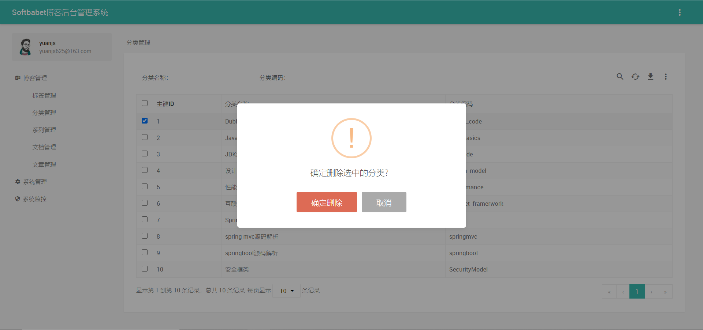
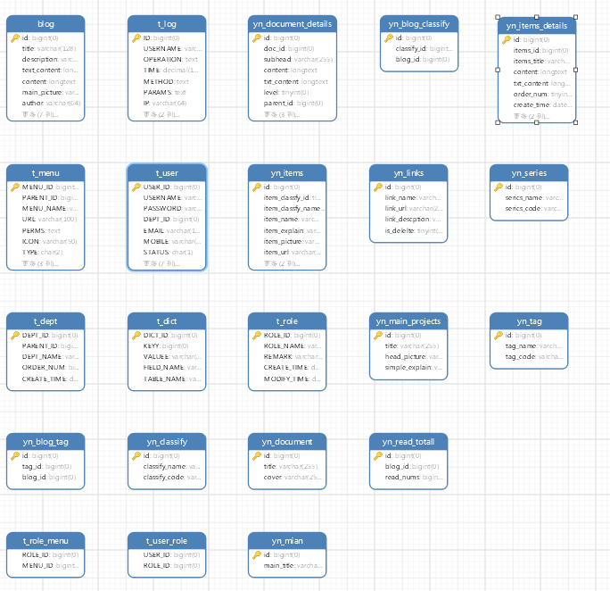

# YN后台管理系统：Yn-manage-system

[ ](http://spring.io/projects/spring-boot) [ ](http://mp.baomidou.com/)[ ](https://www.thymeleaf.org/) [ ](https://projectlombok.org/) [ ](http://freemarker.foofun.cn/) [ ](https://www.bootcss.com/)

 **如果对您有帮助，您可以点右上角 "`Star`" 支持一下 谢谢！**

 **如果您想获悉项目实时更新信息，您可以点右上角 [](https://gitee.com/yuan625/yn-manage-system)感谢您的支持！**

 **本项目还在不断开发完善中,如有建议或问题请通`Issues`反馈！**

### 项目介绍

​     Yn-manage-system是基于SpringBoot+Thymeleaf+Jedis+Bootstrap 研发的后台管理项目，是基于[FEBS-Shiro](https://github.com/wuyouzhuguli/FEBS-Shiro/tree/mysql)项目进行二次开发的。项目基础框架采用全新的Java Web开发框架 —— Spring Boot2.0.4，消除了繁杂的XML配置，使得二次开发更为简单；数据访问层采用Mybatis，同时引入了通用Mapper和PageHelper插件，可快速高效的对单表进行增删改查操作，消除了大量传统XML配置SQL的代码；安全框架采用时下流行的Apache Shiro，可实现对按钮级别的权限控制。项目可以PC端及移动端的能自适应，提高读者的体验。操作体验流畅，使用非常优化，欢迎大家使用及进行二次开发。

### 浏览器兼容

| [](http://godban.github.io/browsers-support-badges/) IE | [](http://godban.github.io/browsers-support-badges/) Edge | [](http://godban.github.io/browsers-support-badges/) Firefox | [](http://godban.github.io/browsers-support-badges/) Chrome | [](http://godban.github.io/browsers-support-badges/) Safari | [](http://godban.github.io/browsers-support-badges/) Opera |
| ------------------------------------------------------------ | ------------------------------------------------------------ | ------------------------------------------------------------ | ------------------------------------------------------------ | ------------------------------------------------------------ | ------------------------------------------------------------ |
| IE 10+                                                       | Edge                                                         | last 15 versions                                             | last 15 versions                                             | last 10 versions                                             | last 15 versions                                             |

### 功能模块

系统功能模块组成如下所示：

```
 ├─系统管理
│  ├─字典管理
│  ├─用户管理
│  ├─菜单管理
│  ├─角色管理
│  └─部门管理
├─系统监控
│  ├─在线用户
│  ├─系统日志
│  ├─Redis监控
│  └─Redis终端
│─博客管理
│  ├─标签管理
│  ├─分类管理
│  ├─系列管理
│  ├─文档管理
│ -├─文章管理
```

### 系统特点

1. 前后端请求参数校验
2. 支持Excel导入导出
3. 前端页面布局多样化，主题多样化
4. 浏览器兼容性好，页面支持PC，Pad和移动端。
5. 代码简单，结构清晰

### 开发者信息

- 系统名称：yn-blog博客系统
- 作者：softbabet
- 邮箱：yuanjs625@163.com

### 页面演示

















### 数据库表


